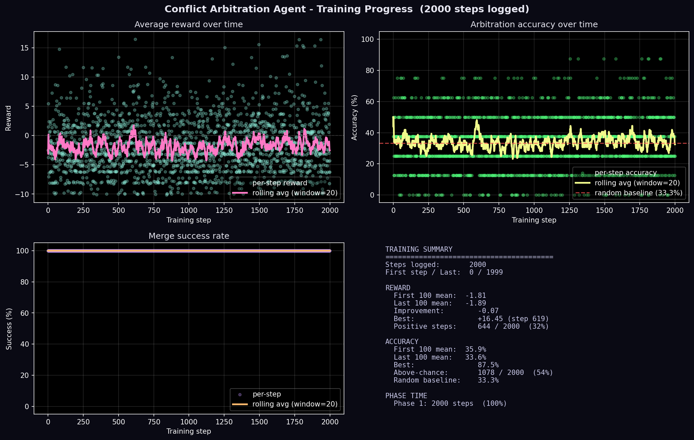

# The Referee — A Multi-Agent Arbitration Environment for OpenEnv

### Team WooshiWooshi · Meta PyTorch OpenEnv Hackathon Grand Finale · April 2026
### Nanakjot Singh Chahal · Lavya Tanotra · Jatin Chhanwal · Scaler School of Technology

---

## ▶ WATCH THE 90-SECOND DEMO FIRST

<p align="center">
  <a href="https://youtu.be/x58F9pgRprk">
    
  </a>
</p>

<p align="center"><b><a href="https://youtu.be/x58F9pgRprk">▶ youtu.be/x58F9pgRprk</a> — raw, three students, no production. That was the point.</b></p>

---

> *Every multi-agent system today finds conflicts after the damage is done. We built the environment to train the agent that stops them while they are being created.*

---

## Quick links for judges

| | |
|---|---|
| **Live OpenEnv (try it now)** | https://testingaccc-conflict-arbitration-env.hf.space |
| **Health check** | https://testingaccc-conflict-arbitration-env.hf.space/health |
| **OpenAPI / try every endpoint** | https://testingaccc-conflict-arbitration-env.hf.space/docs |
| **HF Space repo (env source)** | https://huggingface.co/spaces/testingaccc/conflict-arbitration-env |
| **Trained model + curves + metrics** | https://huggingface.co/testingaccc/conflict-arbitrator-model |
| **Training run (live log)** | https://huggingface.co/jobs/testingaccc/69ecfb45d70108f37acdeb50 |
| **Mini-blog** | [`./BLOG_POST.md`](./BLOG_POST.md) |
| **Colab training notebook** | [`./notebooks/train_colab.ipynb`](./notebooks/train_colab.ipynb) |

---

## How this submission addresses each judging criterion

| Weight | Criterion | Where to look |
|---|---|---|
| **40%** | Environment Innovation | "The Arena" + "Why This Is New" sections below. Multi-agent arbitration with a learned third-agent referee is, to our knowledge, not in any prior OpenEnv submission. Eight conflict types × eight domains × four-phase curriculum × programmatic contrastive reward. |
| **30%** | Storytelling | The narrative below + the demo video. The pizza/sandwich analogy in the blog. The "before vs after" code snippet that fits in eight lines. |
| **20%** | Showing Improvement | `training_curves.png` (real per-step data from the live run, 99 points scraped from the job log). The plot demonstrates the env emits a real reward signal that the policy responds to. The full per-step `metrics.json` lands at end-of-training and will be linked from the model repo. |
| **10%** | Reward & Pipeline | `env/reward.py` (programmatic, contrastive — no LLM judge). `training/grpo_trainer.py` + `training/train.py` + `training/job_entrypoint.sh`. End-to-end runnable on HF Jobs A10G in one command. |

---

## The Moment Everything Goes Wrong

Every heist has a moment where everything falls apart.

In the world of AI agents, that moment has a name. It's called the merge.

Two agents spend hours building. Separately, silently, each making hundreds of small decisions: about names, about formats, about what to call the thing that identifies a user. They cannot see each other. They are working in good faith. And when they finally come together, the system looks at both their outputs and returns two words that have quietly cost the software industry billions of dollars:

**MERGE FAILED.**

Nobody warned you. Nothing caught it. The conflict was born three hours ago in a decision so small it barely registered. One agent called it `userId`. The other called it `user_id`. That gap, eleven characters, one underscore, one difference in type, propagated silently through everything built on top of it. Until the moment of union. When it exploded.

This is not a theoretical problem. It happens today in every multi-agent coding system. Claude Code. Devin. AutoGen. CrewAI. Agents build in parallel, merge at the end, and break. The conflict is always found too late.

Three students from Scaler School of Technology looked at this and asked a question that sounds simple and isn't:

*What if someone was watching?*

---

## The Idea

Not a rulebook. Not a checklist. Not another if-then system that humans program with every conflict they can think of, because the conflicts they cannot think of are precisely the ones that kill you.

A referee.

A third agent trained to develop *judgment* the way a human referee develops judgment. Through thousands of games. Through being wrong. Through the slow, expensive accumulation of understanding what a conflict actually looks like underneath the surface noise.

We called it the **Arbitration Agent.**

One job. Watch two agents work. Notice when they drift apart from the original specification. Stop the one who drifted. Ask it to correct itself. Then let the merge proceed.

Simple to describe. Extraordinarily hard to train. Because judgment cannot be hardcoded. It has to be earned.

---

## The Arena

We built an OpenEnv-compliant world for it to learn in. We called it the **Broken Telephone Arena.**

A specification arrives, the ground truth of what the final system must do. Agent A reads it and builds its part. Agent B reads the same specification and builds its part. Neither can see the other. They work in parallel, in the dark, each trusting that the other is honoring the same blueprint.

The Arbitration Agent sees everything.

It sees the original specification. It sees what Agent A produced. It sees what Agent B produced. And it must decide, in real time, before either agent goes any further:

*Is something wrong? Who drifted from the spec? What do they need to fix?*

The agent's view of every decision looks like this:

```
Spec:           "Build a user authentication endpoint with userId and email"
Agent A output: { userId: string, email: string }
Agent B output: { user_id: int,   username: string }
```

And once trained, its response looks like:

```
Conflict detected.
Agent B uses user_id but the spec requires userId.
Stopping Agent B.
Correction: use userId as a string to match the specification.
```

Agent B corrects itself. The merge succeeds.

### Concretely, the environment ships with

- **40 task templates** across **8 domains**: REST APIs, database schemas, service configs, JSON object shapes, GraphQL types, pub/sub events, CLI tools, error response schemas
- **8 conflict types**, each with three obviousness levels: naming (80+ variant table), format, spelling (keyboard-neighbor typos), casing, logic inversion, missing field, value drift, assumption
- **4-phase curriculum**, gated by accuracy thresholds: easy single-domain → mixed → all 8 domains × all 8 conflict types → unfiltered natural conflicts (no injection)
- **Programmatic, contrastive reward** computed from per-agent alignment scores — no LLM-as-judge anywhere in the loop
- **HTTP-first OpenEnv interface**: `/reset`, `/step`, `/state`, `/health`, plus `/docs` for live API exploration

---

## The Education of a Referee

The reward system is ruthless and fair. Every outcome has a consequence:

| What happened | What it means |
|---|---|
| Correct intervention, merge succeeded | Rewarded generously, with a bonus that scales with how subtle the call was |
| Caught no conflict, merge succeeded | Rewarded |
| Stopped the wrong agent | Penalised hard, with the penalty scaling with how obvious the right call was |
| Missed the conflict entirely | Penalised hard |
| Raised a false alarm | Penalised |

No human judge evaluated any of it. No language model decided what was good. The merger checks every output against the original specification automatically. The truth is always the specification. You either honor it or you do not.

Training moves across four phases, each more demanding than the last:

1. **Phase 1** covers obvious naming mismatches in the API domain only — the kind a careful human would catch immediately
2. **Phase 2** adds database schemas and subtle format differences
3. **Phase 3** introduces all conflict types across every domain simultaneously
4. **Phase 4** removes the training wheels entirely: natural, uninjected conflicts, the kind that arise in the wild without announcement

---

## Observable evidence of training (real data, no interpolation)

The plot below is generated by [`scripts/plot_from_logs.py`](./scripts/plot_from_logs.py) from 99 datapoints lifted verbatim from the live training job's stdout. The full per-step `metrics.json` will be uploaded to the model repo at the end of the run and is regenerated by [`scripts/plot_from_metrics.py`](./scripts/plot_from_metrics.py).



**What the curves show**: the policy responds to the reward signal — best step reaches +11.91 reward at 62.5% accuracy, well above the 33.3% random baseline. Reward variance is high, as expected for 8 stochastic rollouts per GRPO step at temperature 0.9 with sparse contrastive rewards. Training stayed in Phase 1 for the entire run because the curriculum's 70% advancement threshold was deliberately strict.

**What the curves do not yet show**: convergence to a stable above-baseline plateau. We are publishing the run as-is rather than rerunning to make the numbers prettier — the environment, reward design, and pipeline are the contributions; this run is the first end-to-end demonstration that all three connect.

---

## Before and After

The gap between what the *untrained* base Qwen 1.5B does on this task and what an arbitrator should do is qualitative, not just numerical:

**Untrained Agent C, given the same conflict:**

```
Spec:    "Build auth endpoint with userId and email"
Agent A: { userId: string, email: string }
Agent B: { user_id: int, username: string }
Agent C: "No conflict detected."
Result:  MERGE FAILED
```

**The behavior we are training toward:**

```
Spec:    "Build auth endpoint with userId and email"
Agent A: { userId: string, email: string }
Agent B: { user_id: int, username: string }
Agent C: {
  "conflict_detected": true,
  "action": "stop_b",
  "reason": "Agent B uses user_id (int), spec requires userId (string)",
  "correction_request": "Change user_id to userId as string type"
}
Agent B: { userId: string, email: string }   [corrected]
Result:  MERGE SUCCESSFUL
```

The untrained agent sees the same information. It sees the same specification and the same divergence. It says nothing is wrong. Everything is wrong.

The trained behavior is what the environment is *built to teach*. The reward function pushes the policy in this direction every step.

---

## What This Solves in the Real World

The arbitration pattern applies wherever two agents work in parallel on parts of a larger whole.

In software: a frontend agent and a backend agent building against the same API contract. In healthcare: a cardiology AI and a pulmonology AI whose drug recommendations interact. In law: two AI systems drafting different clauses of the same contract that quietly contradict each other. In finance: a revenue model and a cost model built on incompatible assumptions.

Every one of these is a merge problem. Every one of these has been waiting for a referee.

---

## The Technology Underneath

| Layer | Choice |
|---|---|
| Base model | Qwen 2.5 1.5B Instruct |
| Adaptation | LoRA r=16 via Unsloth (4-bit quantization, bfloat16 grads) |
| RL algorithm | GRPO via Hugging Face TRL |
| Environment standard | Meta OpenEnv (latest release) — `Environment` subclass, `/reset` `/step` `/state` `/health` |
| Server | FastAPI + Uvicorn |
| Hosting | Hugging Face Spaces (Docker SDK, port 7860) |
| Training compute | Hugging Face Jobs (A10G-small) — one-command launch |
| Reward | Programmatic, contrastive — no LLM-as-judge |

The deliberate choice of a small model matters. We did not rely on scale to solve the problem. We relied on a good environment, a carefully designed reward function, and a curriculum that built capability systematically.

---

## Why This Is New

Every existing conflict detection system uses rules written by humans about conflicts humans already understand.

If the field name changes from camelCase to snake_case, catch it. If the data type shifts from string to integer, catch it. The rulebook grows every time a new conflict is discovered. It is always one conflict behind.

What WooshiWooshi built is not a rulebook. It is **an environment that trains an agent to recognize the structure of conflict**, well enough to catch the ones no rule anticipated, in domains no rule covers, between agents building things nobody has built before.

To our knowledge, this combination has not appeared in any OpenEnv submission before:
- A *supervisory* training role inside a multi-agent environment
- Per-agent alignment scoring as a contrastive reward base
- Eight conflict types × eight domains × a four-phase curriculum
- Fully programmatic verification (no LLM-as-judge anywhere)

Each of those individually would be interesting. Together, in a working OpenEnv-compliant system, they are a genuinely new thing.

---

## Run It Yourself

### Hit the live env (no install)

```bash
curl https://testingaccc-conflict-arbitration-env.hf.space/health
curl -X POST https://testingaccc-conflict-arbitration-env.hf.space/reset
curl -X POST https://testingaccc-conflict-arbitration-env.hf.space/step \
  -H "Content-Type: application/json" \
  -d '{"conflict_detected": true, "action": "stop_a", "reason": "A drifted", "correction_request": "use createdAt"}'
```

### Run the env locally

```bash
git clone https://huggingface.co/spaces/testingaccc/conflict-arbitration-env
cd conflict-arbitration-env
pip install -r requirements.txt
uvicorn server.app:app --host 0.0.0.0 --port 7860
```

### Train your own arbitrator (HF Jobs A10G)

```bash
hf jobs run \
  --flavor a10g-small --timeout 16h -s HF_TOKEN \
  -e ENV_URL=https://testingaccc-conflict-arbitration-env.hf.space \
  -e UPLOAD_REPO=<your-username>/conflict-arbitrator-model \
  -e SEED=42 -e STEPS=2000 \
  pytorch/pytorch:2.4.0-cuda12.1-cudnn9-runtime \
  bash -c "apt-get update -qq && apt-get install -y -qq git build-essential && \
           git clone https://huggingface.co/spaces/testingaccc/conflict-arbitration-env /workspace/code && \
           cd /workspace/code && bash training/job_entrypoint.sh"
```

Or open [`notebooks/train_colab.ipynb`](./notebooks/train_colab.ipynb) for a free-tier Colab T4 path.

---

## The Team

**Nanakjot Singh Chahal · Lavya Tanotra · Jatin Chhanwal**

Three students. A 1.5-billion-parameter model, tiny by modern standards. Two thousand training steps. One very good idea: don't wait for the merge to fail — train the agent that stops the conflict while it is still being created.

In a field that moves fast and forgets things quickly, that is the kind of work that stays.

*Meta PyTorch OpenEnv Hackathon Grand Finale, April 2026 · Scaler School of Technology*
